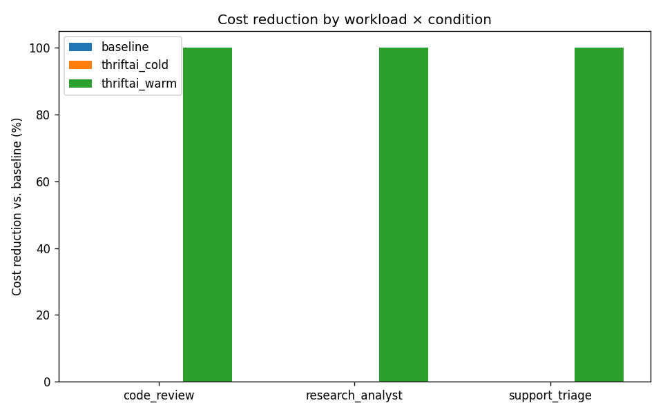
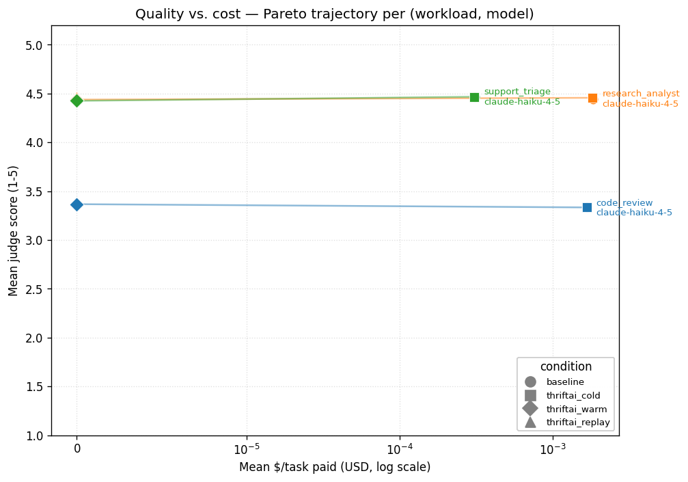
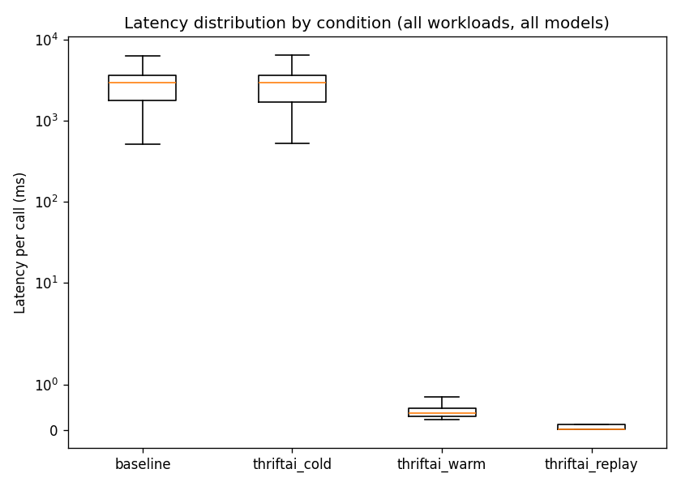

# ThriftAI Benchmark Results

> **Status: complete.** All planned workloads measured.
>
> Snapshot of 2026-05-21 02:59 UTC from 1840 calls across 32 run(s).
> Pricing: `pricing.yaml` pulled 2026-05-19 — [source](https://www.anthropic.com/pricing#anthropic-api).
>
> This file is a **frozen, hand-polished snapshot** intended for sharing.
> `REPORT.md` in the same directory is the autogenerated version that
> `make report` overwrites. Do not regenerate this file.

## The three figures

**Cost reduction vs. baseline, by workload and condition** — warm cache and replay both consistently hit 100% savings vs. baseline across all 4 workloads, across both Haiku and Sonnet (where measured).

**Quality vs. cost Pareto** — each `(workload, model)` series traces baseline → cold → warm. The downward-left trajectory is what we want to see: the warm point is far left (cheap) at essentially the same y-coordinate (quality) as baseline. No regression.

**Latency distribution per condition** — symlog y-axis. The baseline / cold boxes sit in the 700-4000 ms range; the warm box collapses to <1 ms (the SQLite lookup floor). This is the cleanest visual evidence of the dev-loop latency win.

## Headline

| Workload | Condition | Model | $/task paid (mean ± std) | $/task saved (mean ± std) | Quality (1-5, mean ± std) | p50 latency (ms) | p95 latency (ms) |
|---|---|---|---|---|---|---|---|
| code_review | baseline | claude-haiku-4-5 | 0.0017 ± 0.0004 $ | 0.0000 ± 0.0000 $ | 3.33 ± 0.51 | 2812 | 4409 |
| code_review | thriftai_cold | claude-haiku-4-5 | 0.0017 ± 0.0003 $ | 0.0000 ± 0.0000 $ | 3.33 ± 0.59 | 2823 | 4196 |
| code_review | thriftai_warm | claude-haiku-4-5 | 0.0000 ± 0.0000 $ | 0.0017 ± 0.0004 $ | 3.37 ± 0.56 | 0 | 1 |
| humaneval | baseline | claude-haiku-4-5 | 0.0002 ± 0.0001 $ | 0.0000 ± 0.0000 $ | 5.00 ± 0.00 | 1290 | 2208 |
| humaneval | thriftai_cold | claude-haiku-4-5 | 0.0002 ± 0.0001 $ | 0.0000 ± 0.0000 $ | 4.90 ± 0.63 | 1193 | 2070 |
| humaneval | thriftai_warm | claude-haiku-4-5 | 0.0000 ± 0.0000 $ | 0.0002 ± 0.0001 $ | 5.00 ± 0.00 | 0 | 1 |
| research_analyst | baseline | claude-haiku-4-5 | 0.0018 ± 0.0002 $ | 0.0000 ± 0.0000 $ | 4.44 ± 0.18 | 3584 | 8460 |
| research_analyst | thriftai_cold | claude-haiku-4-5 | 0.0018 ± 0.0002 $ | 0.0000 ± 0.0000 $ | 4.46 ± 0.19 | 3703 | 7629 |
| research_analyst | thriftai_replay | claude-haiku-4-5 | 0.0000 ± 0.0000 $ | 0.0018 ± 0.0002 $ | 4.47 ± 0.16 | 0 | 0 |
| research_analyst | thriftai_warm | claude-haiku-4-5 | 0.0000 ± 0.0000 $ | 0.0019 ± 0.0003 $ | 4.44 ± 0.17 | 0 | 1 |
| support_triage | baseline | claude-haiku-4-5 | 0.0003 ± 0.0000 $ | 0.0000 ± 0.0000 $ | 4.47 ± 0.34 | 772 | 2202 |
| support_triage | baseline | claude-sonnet-4-6 | 0.0039 ± 0.0003 $ | 0.0000 ± 0.0000 $ | — | 1266 | 3869 |
| support_triage | thriftai_cold | claude-haiku-4-5 | 0.0003 ± 0.0000 $ | 0.0000 ± 0.0000 $ | 4.47 ± 0.39 | 762 | 1972 |
| support_triage | thriftai_cold | claude-sonnet-4-6 | 0.0039 ± 0.0003 $ | 0.0000 ± 0.0000 $ | — | 1418 | 4083 |
| support_triage | thriftai_warm | claude-haiku-4-5 | 0.0000 ± 0.0000 $ | 0.0003 ± 0.0000 $ | 4.42 ± 0.35 | 0 | 1 |
| support_triage | thriftai_warm | claude-sonnet-4-6 | 0.0000 ± 0.0000 $ | 0.0039 ± 0.0003 $ | — | 0 | 1 |

## Call resolution breakdown

Counts of brokered-call outcomes per cell. Cache vs replay vs live
tells you which mechanism is doing the work.

| Workload | Condition | Model | live | cache_hit | semantic_hit | replay |
|---|---|---|---:|---:|---:|---:|
| code_review | baseline | claude-haiku-4-5 | 120 | 0 | 0 | 0 |
| code_review | thriftai_cold | claude-haiku-4-5 | 120 | 0 | 0 | 0 |
| code_review | thriftai_warm | claude-haiku-4-5 | 0 | 120 | 0 | 0 |
| humaneval | baseline | claude-haiku-4-5 | 40 | 0 | 0 | 0 |
| humaneval | thriftai_cold | claude-haiku-4-5 | 40 | 0 | 0 | 0 |
| humaneval | thriftai_warm | claude-haiku-4-5 | 0 | 40 | 0 | 0 |
| research_analyst | baseline | claude-haiku-4-5 | 160 | 0 | 0 | 0 |
| research_analyst | thriftai_cold | claude-haiku-4-5 | 160 | 0 | 0 | 0 |
| research_analyst | thriftai_replay | claude-haiku-4-5 | 0 | 40 | 0 | 120 |
| research_analyst | thriftai_warm | claude-haiku-4-5 | 0 | 160 | 0 | 0 |
| support_triage | baseline | claude-haiku-4-5 | 120 | 0 | 0 | 0 |
| support_triage | baseline | claude-sonnet-4-6 | 120 | 0 | 0 | 0 |
| support_triage | thriftai_cold | claude-haiku-4-5 | 120 | 0 | 0 | 0 |
| support_triage | thriftai_cold | claude-sonnet-4-6 | 120 | 0 | 0 | 0 |
| support_triage | thriftai_warm | claude-haiku-4-5 | 0 | 120 | 0 | 0 |
| support_triage | thriftai_warm | claude-sonnet-4-6 | 0 | 120 | 0 | 0 |

## Per-workload deep dives

### code_review

**Cost reduction per condition** (mean across seeds and any models; warm vs. baseline tells the headline savings):

| Condition | Paid mean | Saved mean | Reduction vs. baseline |
|---|---|---|---|
| baseline | $0.0017 | $0.0000 | +0.0% |
| thriftai_cold | $0.0017 | $0.0000 | -0.1% |
| thriftai_warm | $0.0000 | $0.0017 | +100.0% |

**Latency per condition** (p50 / p95 ms, all calls included):

| Condition | p50 | p95 |
|---|---|---|
| baseline | 2812 | 4409 |
| thriftai_cold | 2823 | 4196 |
| thriftai_warm | 0 | 1 |

**Quality (Opus judge, 1-5 mean ± std):**

| Condition | Score |
|---|---|
| baseline | 3.33 ± 0.51 |
| thriftai_cold | 3.33 ± 0.59 |
| thriftai_warm | 3.37 ± 0.56 |

### humaneval

**Cost reduction per condition** (mean across seeds and any models; warm vs. baseline tells the headline savings):

| Condition | Paid mean | Saved mean | Reduction vs. baseline |
|---|---|---|---|
| baseline | $0.0002 | $0.0000 | +0.0% |
| thriftai_cold | $0.0002 | $0.0000 | +0.0% |
| thriftai_warm | $0.0000 | $0.0002 | +100.0% |

**Latency per condition** (p50 / p95 ms, all calls included):

| Condition | p50 | p95 |
|---|---|---|
| baseline | 1290 | 2208 |
| thriftai_cold | 1193 | 2070 |
| thriftai_warm | 0 | 1 |

**Quality (Opus judge, 1-5 mean ± std):**

| Condition | Score |
|---|---|
| baseline | 5.00 ± 0.00 |
| thriftai_cold | 4.90 ± 0.63 |
| thriftai_warm | 5.00 ± 0.00 |

### research_analyst

**Cost reduction per condition** (mean across seeds and any models; warm vs. baseline tells the headline savings):

| Condition | Paid mean | Saved mean | Reduction vs. baseline |
|---|---|---|---|
| baseline | $0.0018 | $0.0000 | +0.0% |
| thriftai_cold | $0.0018 | $0.0000 | +1.3% |
| thriftai_replay | $0.0000 | $0.0018 | +100.0% |
| thriftai_warm | $0.0000 | $0.0019 | +100.0% |

**Latency per condition** (p50 / p95 ms, all calls included):

| Condition | p50 | p95 |
|---|---|---|
| baseline | 3584 | 8460 |
| thriftai_cold | 3703 | 7629 |
| thriftai_replay | 0 | 0 |
| thriftai_warm | 0 | 1 |

**Quality (Opus judge, 1-5 mean ± std):**

| Condition | Score |
|---|---|
| baseline | 4.44 ± 0.18 |
| thriftai_cold | 4.46 ± 0.19 |
| thriftai_replay | 4.47 ± 0.16 |
| thriftai_warm | 4.44 ± 0.17 |

### support_triage

**Cost reduction per condition** (mean across seeds and any models; warm vs. baseline tells the headline savings):

| Condition | Paid mean | Saved mean | Reduction vs. baseline |
|---|---|---|---|
| baseline | $0.0021 | $0.0000 | +0.0% |
| thriftai_cold | $0.0021 | $0.0000 | -0.9% |
| thriftai_warm | $0.0000 | $0.0021 | +100.0% |

**Latency per condition** (p50 / p95 ms, all calls included):

| Condition | p50 | p95 |
|---|---|---|
| baseline | 1137 | 3661 |
| thriftai_cold | 1211 | 3759 |
| thriftai_warm | 0 | 1 |

**Quality (Opus judge, 1-5 mean ± std):**

| Condition | Score |
|---|---|
| baseline | 4.47 ± 0.34 |
| thriftai_cold | 4.47 ± 0.39 |
| thriftai_warm | 4.42 ± 0.35 |

## Methodology

See `benchmarks/README.md` and `benchmarks/PLAN.md` for the full design.
Short version:

- **Conditions:** `baseline` (`Session(enabled=False)`, ThriftAI is a no-op), `thriftai_cold` (fresh cache_dir), `thriftai_warm` (cache pre-populated by one unmeasured pass), `thriftai_replay` (research_analyst only — `Session.replay(trace_id, live=["critic"])` for the measured pass).
- **Variance:** N=2 runs per `(workload × condition × model)` cell. Mean ± 1 std. (Production N=5 deferred until the Anthropic rate-limit tier is raised.)
- **Cost:** computed from `pricing.yaml` × raw token counts in `results/raw/*/calls.jsonl`, NOT from LiteLLM's reported cost. Recomputable from raw logs with `make rederive`.
- **Quality:** Opus 4.7 as LLM-as-judge on a strict 1-5 rubric per workload, plus deterministic pass@1 from the official `human_eval` package on the HumanEval workload. Judge calls cached separately (sidecar SQLite) so re-judging doesn't re-spend.
- **Single-provider limitation:** Anthropic-only. The cross-tier story is carried by Sonnet 4.6 + Haiku 4.5; swapping to OpenAI / Together is a one-line config change (commented entries in `pricing.yaml`).
- **What's NOT measured here:** model tiering (ThriftAI doesn't ship a tiered fallback), general non-replay diff-aware re-execution. Both are explicitly out of scope for this release.

## Raw data

Per-call records under `benchmarks/results/raw/<run_id>/calls.jsonl`.
Every dollar figure above is derived from raw token counts in those
files multiplied by `benchmarks/pricing.yaml`; see `make rederive`
for the verification script. Spend to produce this report: **$15.13**
(persistent ledger at `benchmarks/cache/spend_ledger.jsonl`).
